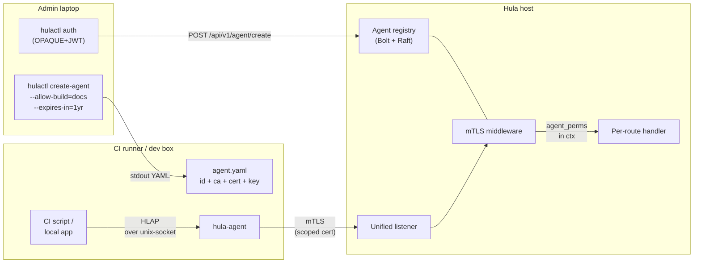
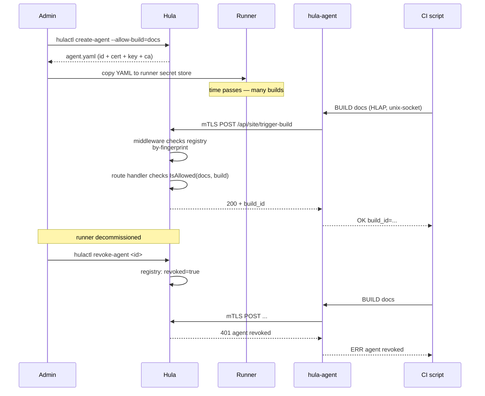

# Agents & HLAP

CI runners and deploy-bots need to drive Hula without holding admin
credentials. The agent model solves that: `hulactl create-agent` mints a
scoped, expiring mTLS certificate; the runner runs `hula-agent` and drives
Hula via HLAP over a unix-socket. **The cert is the only credential.** No
JWT, no admin password, no rotation rituals — when the runner is
decommissioned, `hulactl revoke-agent` is permanent and instant.

## Why a separate model

Human operators use [`hulactl auth`](../quickstart/hulactl.md): OPAQUE
PAKE, password-derived JWT, TOTP optional, JWT expires every 72h and the
human re-authenticates on demand.

Runners can't do that. They have:

- No human to type the password during JWT renewal.
- A working directory on someone else's hardware (GitHub Actions, Jenkins,
  a colleague's laptop) that's harder to trust than a personal device.
- A narrow operational scope — usually one site, two or three verbs.

A scoped, expiring, revocable mTLS cert is the right shape:

- Issuance is **deliberate** (`create-agent` is admin-only).
- Scope is **per-site, per-verb** (`--allow-build=docs` ≠ `--allow-push=docs`).
- Expiry is **mechanical** (the cert's `NotAfter` is checked at every
  handshake, not just at registration time).
- Revocation is **instant** (the registry refuses the next handshake — no
  CRL distribution problem).
- No password to leak, rotate, or re-derive on the runner.

## The picture



Two trust domains, two CAs, deliberate separation:

- **Team CA** — for hula-to-hula traffic in a multi-node Raft cluster.
  Lives only on hula servers.
- **Agent CA** — for runner-to-hula traffic. Lives on hula servers (signs
  agent certs) and inside every agent YAML (the agent uses it to verify
  hula's serving cert? — see [open question §11.1 in the docs PRD](https://github.com/tlalocweb/hulation-docs/blob/main/PRD.md)).

Distinct CAs make it easy to revoke "all agents" (rotate Agent CA) without
disrupting team traffic, and vice versa.

## Cert identity

Every agent's cert encodes its identity in two places:

- **Subject CN** — `agent:<id>` where `<id>` is a base64url-encoded
  16-byte random value generated server-side at `create-agent` time.
- **NotAfter** — the cert's expiry. Operators pick a duration via
  `--expires-in 1yr` (or whatever); hula refuses any cert past `NotAfter`
  even if the registry still has it active.

The middleware extracts `<id>` from the SAN at handshake time, looks it
up in the registry, and refuses the connection if the entry is missing,
revoked, or past expiry.

## The agent registry

Server-side bbolt-backed registry, indexed two ways:

```
_agents/by-id/<id>           → Record{ permissions, created, expires, revoked }
_agents/by-fingerprint/<sha> → "<id>"  (fast lookup at handshake time)
```

`Record.IsActive(now)` returns `true` only when:

- The cert hasn't expired (`now < record.ExpiresAt`).
- The operator hasn't called `revoke-agent` (`record.Revoked == false`).

`Record.IsAllowed(site, verb)` checks the per-site `allow:` map. The
permission string is **opaque to the agent** — agents can't pass arbitrary
options at HLAP-call time; whatever the registered `allow` string says is
what they get.

Wildcards (`"*"` to allow any options) are deliberately not supported.
Operators who need flexibility issue multiple agents.

## Lifecycle



The registry is in the Raft FSM, so revocation is consistent across a
multi-node cluster — every node refuses the cert as soon as the leader
commits the revocation.

## HLAP at a glance

Plain text, line-oriented, on a unix-socket. Local apps send single-line
commands; the agent translates each into one authenticated mTLS call
against hula and returns the result.

```
> BUILD docs
< OK build_id=abc123
< STATUS=complete
< (blank line)
```

Verbs in v1: `BUILD`, `STAGING-BUILD`, `PULL`, `PUSH`, `SYNC`, `COMMIT`,
`STAGE`, `PUSH-FILE`, `GET-FILE`. Wire-level details in the
[HLAP reference](../reference/hlap.md).

## Implementation status

| Phase | Scope | Status |
|-------|-------|--------|
| 1 | Design + `hulactl create-agent` (offline mode) | ✅ shipped |
| 2 | Server-side `/api/v1/agent/create`, Agent CA bootstrap, registry storage | ✅ shipped |
| 3 | mTLS verification middleware + `agent_perms` request context | ✅ shipped |
| 4 | Rust `hula-agent`: config load, unix-socket server, HLAP parser, `BUILD` verb | in development |
| 5 | Remaining HLAP verbs | not started |
| 6 | `hulactl list-agents` / `revoke-agent` + e2e suite | not started |

Today: an admin can mint and register a scoped agent cert, hula will
correctly reject revoked / expired / unknown certs at handshake, and a
test client can open an mTLS connection. The Rust runner-side binary is
catching up. Track progress in
[`HULAAGENT_PLAN.md`](https://github.com/tlalocweb/hulation/blob/main/HULAAGENT_PLAN.md).

## Threat model

Things the agent model is designed to handle:

- **Runner compromise.** Steals the cert and key. The cert is scoped, so
  the blast radius is at most "do the verbs the cert was issued for, on
  the sites it was issued for". When the compromise is detected, one
  `hulactl revoke-agent` shuts it down.
- **Runner shared with other workloads.** The unix-socket is filesystem-
  permission-gated; the YAML must be `chmod 600`. Agents on shared CI
  hosts should run as their own UID.
- **Lost cert.** Same as compromise — revoke and re-mint. There's no
  recovery path other than re-issuance, by design.

Things outside the model:

- **Compromised admin laptop.** Whoever can run `hulactl auth` as admin
  can mint arbitrary new agents. This is no different from the
  pre-agent threat model — admin credentials are the trust root.
- **Hula host compromise.** An attacker with code execution on the hula
  host owns everything anyway: registry, certs, the rest of the
  storage layer.

The agent CA's private key lives at `<data_dir>/agent-ca.key` (mode
`0600`). Roll it via the `revoke-agent` + re-mint flow when individual
agents are compromised; rotate the CA itself only if the CA key is
compromised, since it invalidates every existing agent.

## Where to go next

- [hulaagent Quick Start](../quickstart/hulaagent.md) — admin mints,
  runner runs.
- [HLAP reference](../reference/hlap.md) — wire protocol, every verb.
- [Agent YAML reference](../reference/agent-yaml.md) — schema and field
  semantics.
- [`hula-agent` binary reference](../reference/hula-agent.md) — flags,
  lifecycle, security notes.
- [`hulactl create-agent`](../reference/hulactl.md#agents) — admin-side
  CLI.
