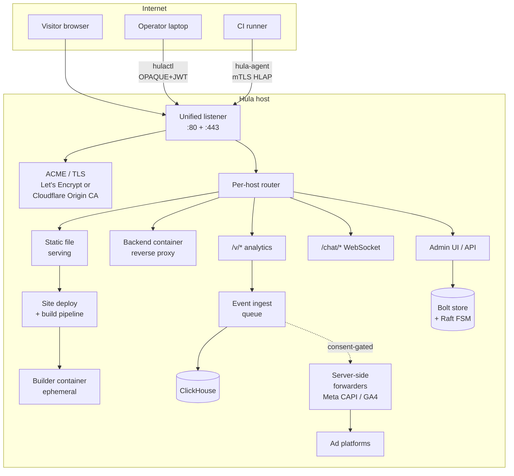

# Architecture overview

Hula is a single Go binary plus a ClickHouse companion. Everything else — the
unified listener, virtual servers, the build pipeline, the analytics path, the
storage layer, the optional chat / push / forwarder surfaces — is wired up
inside that one binary at boot time. This page is the map.

## The picture



Key points to read off this diagram:

- **One listener, two ports** (80 and 443 by default). Hula sniffs the first
  bytes of every connection to decide whether it's HTTP, TLS, or an HTTP-01
  ACME challenge — no separate process per role.
- **Per-host routing** is the first decision after TLS termination. Each
  `servers:` entry in `config.yaml` is a virtual host; the `Host:` header (or
  SNI for TLS) picks which one.
- **Two storage paths.** Bolt (with the single-node Raft FSM in front of it)
  for ACL / agent registry / OPAQUE records / goals / reports — the "small
  but consistent" state. ClickHouse for visitor and event analytics — the
  "big and append-mostly" state.
- **Builds run in ephemeral containers.** `hulabuild` (a small Go binary
  built from the same repo) is the entrypoint of every builder image; Hula
  spawns a container per build, streams the source in, runs the
  COMMANDLIST, copies the output back, and removes the container.
- **Two operator-side credentials, two threat models.** Humans use
  `hulactl auth` (OPAQUE PAKE → JWT, password never on the wire). CI runners
  use `hula-agent` (mTLS, scoped cert, no JWT, no password). Both terminate
  on the same listener.

## What's in the box

The following surfaces are all in the same binary, configured in the same
`config.yaml`, and share the same listener:

| Surface | Source dirs | Notes |
|---------|-------------|-------|
| Unified listener (HTTP + TLS protocol detection) | [`server/`](https://github.com/tlalocweb/hulation/tree/main/server) | Single port can host ACME + manual + Cloudflare-Origin-CA simultaneously across servers. |
| Static file serving | [`handler/`](https://github.com/tlalocweb/hulation/tree/main/handler) | Byte-range, transparent compression, immutable cache control. |
| Git autodeploy | [`sitedeploy/`](https://github.com/tlalocweb/hulation/tree/main/sitedeploy) | Hugo, Astro, Gatsby, MkDocs auto-detected; production + staging shapes. |
| Backend containers (reverse proxy) | [`backend/`](https://github.com/tlalocweb/hulation/tree/main/backend) | Per-server Docker network isolation. |
| Visitor analytics | `handler/visitor.go` + [`pkg/analytics/`](https://github.com/tlalocweb/hulation/tree/main/pkg/analytics) | Hello / landing / form / conversion / goal events. |
| Forms & landers | `handler/form.go`, `handler/lander.go` | Versioned CRUD, Risor hooks. |
| Live chat | [`pkg/chat/`](https://github.com/tlalocweb/hulation/tree/main/pkg/chat) | WebSocket transport, badactor-gated. |
| Bot defense (badactor) | [`badactor/`](https://github.com/tlalocweb/hulation/tree/main/badactor) | Radix-tree IP scoring with TTL. |
| Auth (OPAQUE, TOTP, OIDC) | [`pkg/auth/opaque/`](https://github.com/tlalocweb/hulation/tree/main/pkg/auth/opaque) | OPAQUE-only handshake; TOTP at-rest encrypted. |
| Push notifications | [`pkg/notifier/`](https://github.com/tlalocweb/hulation/tree/main/pkg/notifier) | APNs + FCM + email fan-out. |
| Server-side forwarders | [`pkg/forwarder/`](https://github.com/tlalocweb/hulation/tree/main/pkg/forwarder) | Meta CAPI, GA4 — consent-gated by `purpose`. |
| Single-node Raft (HA Stage 2) | [`pkg/store/storage/raft/`](https://github.com/tlalocweb/hulation/tree/main/pkg/store/storage/raft) | Default for solo installs. |
| Agent CA + registry | [`pkg/agent/`](https://github.com/tlalocweb/hulation/tree/main/pkg/agent) | mTLS sidecar trust domain. |

The full surface is deep — the Reference and Concepts sections of this site go
into each piece individually.

## Process model

Two processes in production, both Docker containers by default:

- **`hula`** — the Go binary, listening on 80 + 443, holding all the in-memory
  state for the analytics ingest queue, the badactor radix tree, the
  per-server Risor hook compilations, and so on.
- **ClickHouse** — pinned at `clickhouse/clickhouse-server:latest` by the
  installer. Hula connects on `dbconfig.port` (default 9000). Schema is
  created idempotently on first boot via `hulactl initdb` or automatic
  migration.

Optional / stateful sidecars:

- **Builder containers** are spawned per build, run for the duration of the
  build (or the long-lived staging session), and removed. Image is
  `hula-builder-default` by default.
- **Backend containers** are managed by Hula on behalf of `servers[].backends:`
  entries. Hula starts them at boot, isolates them on per-server Docker
  networks, and reverse-proxies a configured `virtual_path` to each.

When run inside Docker, Hula needs `/var/run/docker.sock` mounted to manage
builder + backend containers.

## Boot sequence

What actually happens in `main.go` → `server/run_unified.go`:

1. **Parse `config.yaml`** ([`config/config.go`](https://github.com/tlalocweb/hulation/blob/main/config/config.go)).
   Substitute `${ENV_VAR}` references, validate against the conftagz tag
   schema, expand path templates.
2. **Open Bolt** + initialise the **storage layer**. Single-node Raft
   auto-bootstraps a `TeamID` + `NodeID` if no `team:` block is configured.
3. **Initialise the Agent CA** ([`pkg/agent/pki/persist.go`](https://github.com/tlalocweb/hulation/blob/main/pkg/agent/pki/persist.go)) —
   `<data_dir>/agent-ca.{pem,key}` is generated if absent.
4. **Connect to ClickHouse** with `dbconfig.retries` × `dbconfig.delay_retry`
   backoff. Run schema migrations.
5. **Compile per-server hooks** (Risor scripts in `on_new_form_submission`,
   `on_lander_visit`, `on_new_visitor`).
6. **Sweep orphan builders** — any `hula-builder-*` containers from a
   previous crashed run get force-removed.
7. **Start backend containers** per `servers[].backends:`.
8. **Build the unified listener** with all servers' TLS configurations
   merged. Open ports.
9. **Wire the agent-mTLS middleware** so HLAP traffic gets routed through
   the registry lookup before reaching the per-route handler.
10. **Pull and build any sites** with `root_git_autodeploy` configured;
    long-lived staging containers come up here.
11. **Start the chat WebSocket loop** if `chat:` is enabled (default on with
    sane defaults).
12. **Ready.** First visitor request is served.

The unified listener stays up for the process lifetime. `hulactl reload`
sends `SIGHUP`, which re-reads `config.yaml` and re-runs steps 5, 7, 9, 10
in place — no port flap, no dropped connections.

## Request lifecycle (visitor)

A typical visitor GET request:

```mermaid
sequenceDiagram
    participant V as Visitor
    participant L as Unified listener
    participant B as Badactor scorer
    participant R as Per-host router
    participant H as Static handler
    participant A as Analytics path
    participant CH as ClickHouse

    V->>L: TCP + TLS handshake
    L->>B: Score on handshake failure or<br/>known-probe path
    L->>R: Decoded HTTP request
    R->>H: Match server by Host:
    H-->>V: 200 + body (cached cert; <br/>byte-range, gzip if requested)
    Note over H,A: Visitor JS fires /v/hello asynchronously
    V->>L: POST /v/hello
    L->>R: Route to analytics handler
    R->>A: Decode + consent-gate
    A->>CH: Persist event row
    A-->>V: 204 (or 200 + Hula-Consent-Required)
```

The synchronous content path (request → static handler → response) does not
block on ClickHouse. Analytics events are emitted asynchronously by the
visitor's browser via the `/v/*` endpoints; ingest runs in its own goroutine
pool with a bounded queue.

## Storage layout

Two on-disk locations matter operationally:

- **`data_dir`** (default `/var/hula/data`) — Bolt + Raft state. Holds
  ACL, OPAQUE records, agent registry, the Agent CA's key, goals, reports,
  and the Raft log itself. **Back this up.** Losing it means re-issuing
  every operator credential and every agent.
- **`ssl.acme.cache_dir`** (default `<confdir>/certs`) — issued
  Let's Encrypt certs. Survivable but expensive to re-issue (rate limits).

ClickHouse data lives in its container's volume — backup follows ClickHouse's
standard story (`BACKUP TABLE ... TO ...` or volume snapshots).

## Where to go next

- **[Servers, hosts, aliases](servers-hosts.md)** — the per-virtual-host model
  in depth.
- **[TLS modes](tls.md)** — manual, ACME, Cloudflare Origin CA.
- **[Git autodeploy & staging](git-autodeploy.md)** — the build pipeline.
- **[High availability](ha.md)** — the Raft / multi-node story.
- **[Configuration reference](../reference/config.md)** — every key in
  `config.yaml`.
