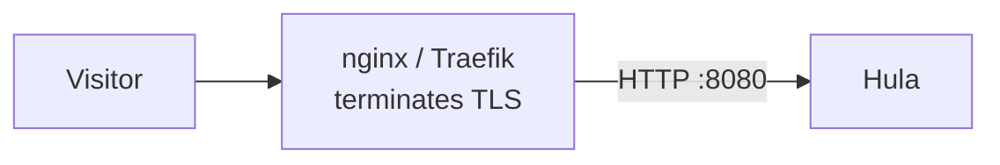

# Behind nginx / Traefik

Run Hula behind another reverse proxy. The proxy handles public 80/443
and TLS termination; Hula listens on an internal port and trusts the
proxy's `X-Forwarded-*` headers. Useful when:

- Hula shares the host with other services that need port 443.
- Your org standardises on nginx / Traefik / Caddy / HAProxy as the
  edge.
- You need WAF / CDN features the front proxy provides.

For Cloudflare specifically, use [Origin CA mode](cloudflare-origin-ca.md)
instead — Cloudflare isn't a generic reverse proxy.

## Setup



Hula runs un-TLS'd internally — the front proxy is the TLS edge. ACME
(if used by Hula) is forwarded by the proxy on the
`/.well-known/acme-challenge/` path.

## Hula config

```yaml
port: 8080
external_http_scheme: https
hula_host: example.com

servers:
  - host: example.com
    aliases: [www.example.com]
    id: example
    http_scheme: https
    root: /var/hula/sites/example/public
```

No `ssl:` block — the front proxy handles TLS.

If Hula still wants to manage its own ACME (e.g., for an internal
domain), set:

```yaml
ssl:
  acme:
    email: admin@example.com
    cache_dir: /var/hula/certs
    http_port: 8081
```

The proxy then forwards `/.well-known/acme-challenge/` from port 80 to
Hula's `http_port`.

## nginx

A minimal nginx config for the proxy side. See the
[nginx docs](https://nginx.org/en/docs/) for full syntax.

Key directives:

- `proxy_pass http://127.0.0.1:8080;` to forward.
- `proxy_set_header Host`, `X-Real-IP`, `X-Forwarded-For`,
  `X-Forwarded-Proto`, `X-Forwarded-Host` — Hula reads these.
- `proxy_http_version 1.1;` — required for keep-alive and WebSockets.
- WebSocket upgrade: `proxy_set_header Upgrade` and
  `proxy_set_header Connection` (using a `map` block to set
  `Connection` based on whether `Upgrade` is present).
- `proxy_buffering off;` and a long `proxy_read_timeout` (10+ minutes)
  for the streaming build-status endpoint.

A complete reference snippet is maintained in the
[hulation-docs repo](https://github.com/tlalocweb/hulation-docs/tree/main/snippets/nginx-hula.conf)
(coming soon).

## Traefik

`docker-compose.yml`:

```yaml
services:
  traefik:
    image: traefik:v3
    command:
      - --providers.docker=true
      - --providers.docker.exposedbydefault=false
      - --entrypoints.web.address=:80
      - --entrypoints.websecure.address=:443
      - --certificatesresolvers.le.acme.email=admin@example.com
      - --certificatesresolvers.le.acme.storage=/acme/acme.json
      - --certificatesresolvers.le.acme.httpchallenge.entrypoint=web
    ports:
      - "80:80"
      - "443:443"
    volumes:
      - /var/run/docker.sock:/var/run/docker.sock:ro
      - ./acme:/acme

  hula:
    image: ghcr.io/tlalocweb/hula:latest
    expose:
      - "8080"
    volumes:
      - ./config.yaml:/etc/hula/config.yaml:ro
      - ./public:/var/hula/public:ro
    labels:
      - traefik.enable=true
      - traefik.http.routers.hula.rule=Host(`example.com`)
      - traefik.http.routers.hula.tls=true
      - traefik.http.routers.hula.tls.certresolver=le
      - traefik.http.services.hula.loadbalancer.server.port=8080
```

Traefik handles ACME, TLS termination, and forwarding. The
`certresolver=le` triggers the HTTP-01 challenge dance. WebSocket
upgrades work without manual config.

## Caddy

```text
example.com, www.example.com {
    reverse_proxy 127.0.0.1:8080
}
```

That's it. Caddy auto-handles ACME, sets the standard `X-Forwarded-*`
headers, and passes WebSocket upgrades through. Add explicit
`header_up` directives only when you need to override a specific
header.

## Header trust

Hula reads these `X-Forwarded-*` headers for client-IP and scheme
resolution:

| Header | Used for |
|--------|----------|
| `X-Forwarded-For` | Client IP (last hop in the chain). |
| `X-Real-IP` | Client IP fallback. |
| `X-Forwarded-Proto` | Original scheme (`https` or `http`). |
| `X-Forwarded-Host` | Original `Host:` header. |

**These are trusted unconditionally** — there's no allowlist of trusted
proxies in Hula today. So:

- Run Hula on `127.0.0.1:8080` (or a private network), not on a public
  IP, when behind a proxy.
- Make sure firewall blocks direct access to the internal port from
  the internet.

## WebSocket support

Chat endpoints (`/chat/*`) require WebSocket upgrade. nginx and
HAProxy need explicit `Upgrade` and `Connection` header forwarding;
Traefik and Caddy handle it automatically.

## Streaming endpoints

Build-status streaming keeps the response open while a build
progresses. Configure your proxy to:

- Disable response buffering.
- Increase read timeout to at least 10 minutes for long builds.

In nginx: `proxy_buffering off;` and `proxy_read_timeout 600s;` inside
the `location /` block.

## ACME challenge forwarding

Two patterns:

**A. Front proxy handles ACME entirely** (recommended). The proxy gets
its own cert via Let's Encrypt; Hula has no `ssl:` block. Simplest
setup.

**B. Hula handles ACME, proxy forwards challenges**. Useful when Hula
needs different certs per server and you don't want to duplicate config
in the proxy. Set `ssl.acme.http_port: 8081` in Hula and forward
`/.well-known/acme-challenge/` from port 80 to that port. Adds
complexity for limited benefit; pick A unless you have a specific reason.

## Locking down the internal port

Bind only to localhost:

```bash
ss -tlnp | grep 8080
```

If Hula runs in Docker, expose only on the bridge:

```bash
docker run -p 127.0.0.1:8080:8080 ...
```

Add a firewall rule as belt-and-braces:

```bash
sudo ufw allow from 127.0.0.1 to any port 8080
sudo ufw default deny incoming
```

## Troubleshooting

**Hula sees the proxy's IP for every request.** `X-Forwarded-For`
isn't being set. Confirm the proxy sends it. Test against the internal
port to verify the header propagates.

**Mixed-content warnings in the browser.** Hula publishes HTTP URLs in
`hula.js` because it doesn't know it's behind TLS. Set
`http_scheme: https` on the affected `servers[]` entry and
`external_http_scheme: https` at the top level.

**Chat WebSocket fails with HTTP 101 then immediate disconnect.**
Proxy isn't forwarding the `Upgrade` header. nginx config needs the
`map $http_upgrade $http_connection` block plus
`proxy_set_header Upgrade` and `proxy_set_header Connection`.

**Build-status polling times out at 60s.** Default proxy read timeout
is too low for long builds. Raise to 10 minutes.

## Next

- [Behind Cloudflare](cloudflare-origin-ca.md) — Cloudflare-specific
  flow with Origin CA.
- [Backend container reverse proxy](backend-containers.md) — Hula
  reverse-proxying *its own* backends, when Hula is the edge.
- [Configuration reference](../reference/config.md) — every TLS /
  scheme / port option.
