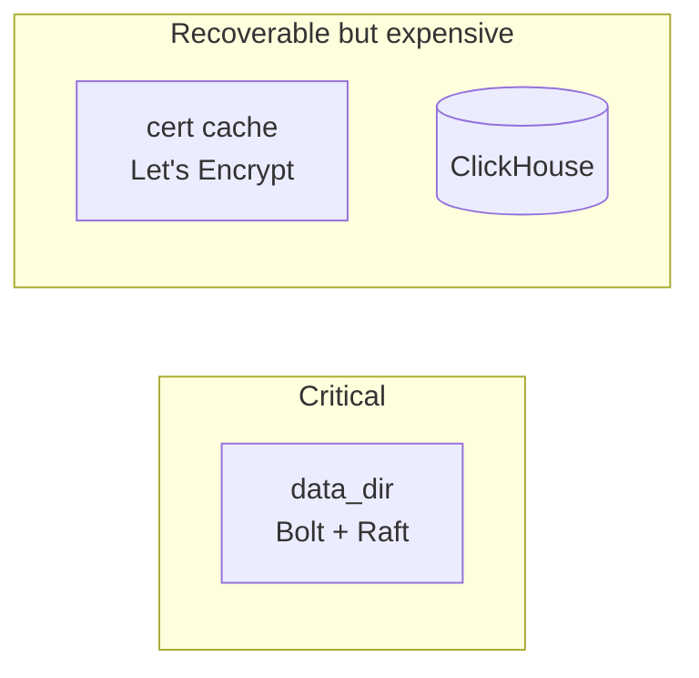
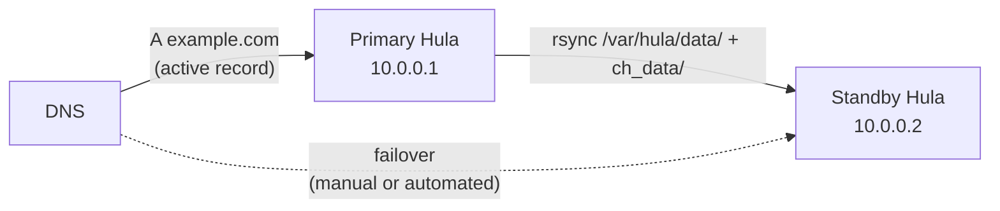

# Backups & restore

Hula's persistent state lives in three places, with very different
recovery shapes. Back up all three; understand the recovery cost for
losing each.

## What to back up



| Location | Default path | Holds | Loss cost |
|----------|--------------|-------|-----------|
| `data_dir` | `/var/hula/data/` | OPAQUE records, agent registry, agent CA, ACL, goals, reports, Raft log | **Critical.** Re-issue every operator credential and every agent. |
| Cert cache | `<confdir>/certs` (or `ssl.acme.cache_dir`) | Issued Let's Encrypt certs | Recoverable. Re-issuance subject to LE rate limits (50/week per registered domain). |
| ClickHouse data | `ch_data/` (host volume) | Visitor + event analytics | Recoverable from snapshot; not from upstream re-pull (events are observed, not stored elsewhere). |
| Staging source dirs | `/var/hula/sitedeploy/{{serverid}}/staging-src` | In-progress writer edits | Recoverable from upstream Git. Outstanding uncommitted edits are lost. |

The `public/` directories Hula serves don't need backup — they're
either Git-cloned (re-clone) or generated from a builder (rebuild).

## What lives in `data_dir`

```text
/var/hula/data/
├── hula.db              # main Bolt file: OPAQUE records, ACL, goals, ...
├── agent-ca.pem         # Agent CA cert (mode 0644)
├── agent-ca.key         # Agent CA private key (mode 0600)  ← treat as secret
├── team-id              # Raft team UUID
├── node-id              # Raft node ID for this host
├── raft/                # Raft log + snapshots (raft-boltdb)
│   ├── raft.db
│   └── snapshots/
└── cookieless_salts/    # per-server cookieless visitor-ID salts (in hula.db, not separate)
```

Bolt is single-writer. **Hula must be stopped to safely copy `hula.db`**
(or use Bolt's online backup API via `hulactl`, see below).

## Routine backup

### Bolt + Raft

**Offline copy** (Hula stopped, simplest):

```bash
./start-with-docker.sh --stop
tar czf /backups/hula-data-$(date +%F).tgz /var/hula/data/
./start-with-docker.sh
```

**Online via `hulactl`** (Hula running, recommended for HA):

```bash
hulactl backup --out /backups/hula-data-$(date +%F).tgz
```

This uses Bolt's `Tx.WriteTo` to write a consistent snapshot without
stopping the writer. Includes `hula.db`, the agent CA files, and a
manifest describing what's included.

(The `hulactl backup` subcommand is on the roadmap; today, plan around
the offline-copy flow.)

### Cert cache

```bash
tar czf /backups/hula-certs-$(date +%F).tgz /var/hula/certs/
```

Safe to take while Hula is running — the cert cache is read mostly,
and an in-progress write to a single cert file is atomic via `tmp +
rename`.

### ClickHouse

Two options:

**ClickHouse `BACKUP TABLE` API** (preferred):

```sql
BACKUP TABLE hula.events
  TO Disk('s3', 'backup/events-2026-05-07.zip');
```

Configure an S3-typed disk in ClickHouse's storage config. Backups are
incremental and pull-able from anywhere with credentials.

**Volume snapshot:**

```bash
./start-with-docker.sh --stop
tar czf /backups/clickhouse-data-$(date +%F).tgz ch_data/
./start-with-docker.sh
```

Simple, but requires stopping. For zero-downtime, use the SQL `BACKUP`.

### Staging source dirs

Staging is the only place writer edits live before they're committed.
Worth backing up if you have active writers:

```bash
tar czf /backups/staging-$(date +%F).tgz /var/hula/sitedeploy/*/staging-src/
```

Or push uncommitted work to Git as a fallback:

```bash
hulactl stage <site>
hulactl commit <site> "checkpoint: pre-backup"
hulactl push <site>
```

## Rotation policy

A reasonable starting point — adjust to your RPO / RTO:

| Backup | Frequency | Retention |
|--------|-----------|-----------|
| `data_dir` | Daily | 30 days |
| Cert cache | Weekly | 4 weeks |
| ClickHouse | Daily incremental, weekly full | 30 / 90 days |
| Staging src | On-demand | While writers active |

The data_dir backup is the small, important one — it's a few MB and
contains the keys to the kingdom. Cert cache is a few hundred KB.
ClickHouse will dominate space costs on a busy site.

## Restore

### Whole-host disaster (re-deploy from scratch)

```bash
# 1. Bring up a fresh Hula host (same IP, or update DNS).
curl -fsSL https://raw.githubusercontent.com/tlalocweb/hulation/main/install.sh | bash

# 2. Stop the freshly-installed instance.
cd hula
./start-with-docker.sh --stop

# 3. Restore data_dir.
sudo rm -rf /var/hula/data
sudo tar xzf /backups/hula-data-LATEST.tgz -C /

# 4. Restore cert cache (skip if you're OK re-issuing; ACME will run on first request).
sudo tar xzf /backups/hula-certs-LATEST.tgz -C /

# 5. Restore ClickHouse.
sudo tar xzf /backups/clickhouse-data-LATEST.tgz -C ./

# 6. Restore config.yaml (your previous backup or version control).
cp /backups/config.yaml ./config.yaml

# 7. Start.
./start-with-docker.sh
```

DNS-pointing aside, a full restore is ~5 minutes. Live chat sessions
do not survive (they were in-memory); analytics, operator credentials,
agents, certs all do.

### Lost data_dir (Bolt corruption, etc.)

If `hula.db` is unreadable or the agent CA is gone:

1. **Restore from the latest backup.** This is the only path that
   preserves OPAQUE records and existing agents.
2. **If no backup exists**, you're rebuilding from zero:
   - Generate fresh OPAQUE keys (`hulactl opaque-seed`).
   - Re-enroll the admin password (`hulactl set-password`).
   - Re-mint every agent (`hulactl create-agent` per agent).
   - The agent CA regenerates automatically on next boot — every
     existing agent's cert becomes invalid.

The "no backup" path takes hours of operator time across a fleet of
agents. Hence: **back up `data_dir`.**

### Lost cert cache

ACME re-issues on the next request:

```bash
rm -rf /var/hula/certs
./start-with-docker.sh --restart
# First request to https://example.com triggers fresh issuance.
```

Watch the rate-limit budget — Let's Encrypt allows 50 certificates per
registered domain per week. A multi-site Hula losing all certs at once
can hit this limit quickly. Use the [staging environment](https://letsencrypt.org/docs/staging-environment/)
for testing before triggering live re-issuance.

### Lost ClickHouse data

Restore from snapshot. Without a snapshot, the analytics rows are gone
— they're observed-only. The site keeps serving; live-chat keeps
working; only the historical analytics are lost.

```sql
-- From a SQL backup:
RESTORE TABLE hula.events
  FROM Disk('s3', 'backup/events-2026-05-07.zip');
```

## Warm-spare pattern

For zero-RTO recovery, run a passive secondary that pulls backups
periodically:



`rsync --delete` once an hour, atop a Bolt-quiescing flow:

```bash
#!/bin/bash
# On primary, every hour
docker exec hula sh -c 'kill -USR1 1'    # signal Hula to flush + quiesce briefly
sleep 5
rsync -aP --delete /var/hula/data/ standby:/var/hula/data/
rsync -aP --delete ch_data/ standby:/path/to/ch_data/
docker exec hula sh -c 'kill -USR2 1'    # resume
```

(The `USR1` / `USR2` quiesce hooks are on the roadmap. Today, accept
the small risk of a partial copy if Hula writes during the rsync —
the next hour's rsync converges.)

The cleaner answer for zero-RTO is **multi-node Raft HA** (see
[High availability](../concepts/ha.md)), where the spare is part of
the cluster and storage state is replicated synchronously.

## Backup verification

A backup you haven't tested is a hope, not a backup. Quarterly:

1. Restore to a throwaway VM.
2. Start Hula against the restored data_dir + cert cache + ClickHouse.
3. `hulactl authok` (admin credentials work).
4. `hulactl listforms` (operational data round-trips).
5. Pull up the analytics UI, confirm a recent visitor count.

Time-box at 30 minutes; if you can't restore in 30 minutes you'll
discover it during a real incident.

## Off-host storage

Backups stored on the same host they're protecting are
inadequate-by-design. Ship to:

- An object store (S3, GCS, Backblaze B2 — use lifecycle rules for
  rotation).
- A separate-region NAS or VM.
- An offline copy for ransomware insurance (a USB pulled out and
  stored elsewhere monthly is fine).

Encrypted in transit and at rest. The Bolt file contains the agent
CA private key and OPAQUE records — treat it as secret.

## Where to go next

- [Upgrading Hula](upgrading.md) — back up before upgrading.
- [Troubleshooting](troubleshooting.md) — recovery from broken state.
- [High availability](../concepts/ha.md) — multi-node Raft for
  hot-spare durability.
