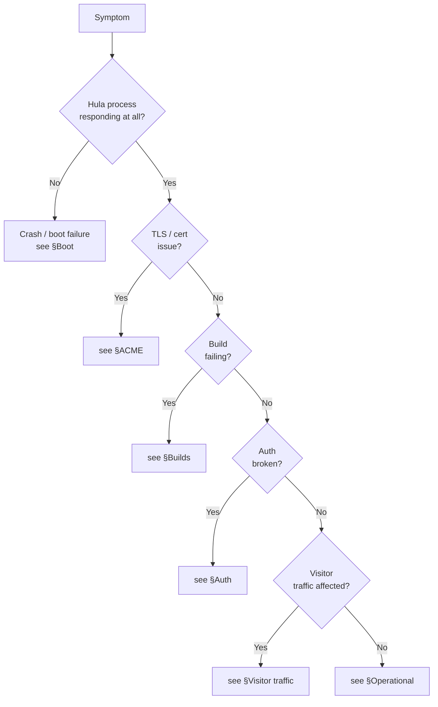

# Troubleshooting

Practical triage. For each common failure: the symptom you'll see, the
one diagnostic command, and the fix.

## Triage flow



If the whole host is unresponsive, jump to [Boot](#boot-crash) — that
covers complete-failure cases. Otherwise the section per symptom is
the fastest path.

---

## Boot / crash

### Hula won't start

```bash
./start-with-docker.sh --logs
```

Look at the first 20 lines of the log. The most common boot failures:

**`bind: address already in use` on port 443.** Something else is
listening on 443 — usually a previous Hula container that didn't stop
cleanly:

```bash
docker ps -a --filter "name=hula"
docker rm -f hula
./start-with-docker.sh
```

**`config: error parsing config.yaml`.** Validation failed. Hula prints
the field that's wrong. Fix the config and restart.

**`error opening bolt: timeout`.** Another Hula process is holding
`hula.db` open. Find and stop it:

```bash
sudo lsof /var/hula/data/hula.db
```

**`clickhouse: connection refused`.** ClickHouse isn't up. With the
default `dbconfig.retries: 5` and `delay_retry: 5`, Hula waits 25s for
the database before exiting. Either start ClickHouse first, or raise
the retry count for boot ordering:

```yaml
dbconfig:
  retries: 30
  delay_retry: 2
```

**`schema migration failed`.** A ClickHouse migration's forward step
refuses to run. See [Upgrading — common pitfalls](upgrading.md#common-upgrade-pitfalls).

### Hula crashes after running for a while

Three usual culprits:

- **OOM kill** — `dmesg | grep -i 'killed process'`. Bump the
  container's memory limit or move ClickHouse to a separate host.
- **Disk full** — `df -h`. ClickHouse fills disk fastest; trim
  retention or add storage.
- **Panic in a goroutine** — the log shows the stack trace. File an
  issue at [github.com/tlalocweb/hulation/issues](https://github.com/tlalocweb/hulation/issues)
  with the trace.

---

## ACME / TLS

### `certificate verify failed` in browser

The cert hasn't been issued yet, or hasn't propagated to the listener.

```bash
./start-with-docker.sh --logs | grep '\[acme\]'
```

Look for `acme: certificate issued for example.com`. If absent:

**`acme: connection refused on port 80`.** Port 80 isn't reachable
from the public internet. Open the firewall:

```bash
sudo ufw allow 80/tcp
```

Behind a reverse proxy, set `ssl.acme.http_port` to the internal port
the proxy forwards challenges to.

**`acme: dns problem`.** DNS A record doesn't resolve. Check:

```bash
dig +short example.com
```

If empty or wrong, fix DNS and wait for propagation (TTL-bound, usually
< 5 min).

**`acme: too many certificates already issued for: example.com`.**
Hit the Let's Encrypt rate limit (50 / week per registered domain).
Wait for the rolling window to free up, or use the
[staging environment](https://letsencrypt.org/docs/staging-environment/)
for testing without burning prod budget.

### Cert was issued but browser still sees the old cert

Browser cache. Hard-reload (Ctrl-Shift-R). If you can't get a clean
state, open in an incognito window — that proves Hula's side is fine.

If it's still wrong: confirm with `openssl s_client`:

```bash
openssl s_client -connect example.com:443 -servername example.com < /dev/null 2>/dev/null | openssl x509 -noout -dates -subject
```

Should show recent dates. If old, check `hula_certs/` on disk —
there may be a stale cert that overwrote the new one.

### Cert expired

Renewals happen automatically. If a cert is expired, the renewer
failed:

```bash
./start-with-docker.sh --logs | grep -i 'renew\|expir'
```

Common renewal failures: same as initial issuance (port 80 broke,
DNS broke). Fix the underlying cause; force renewal by removing the
specific cert from the cache:

```bash
rm hula_certs/example.com
hulactl reload
```

---

## Builds

### `hugo: not found` (or mkdocs / astro / gatsby not found)

The builder image doesn't ship the requested generator. Default
`hula-builder-default` ships all four, so this means:

- You overrode `builder_image:` to a custom image that's missing the
  binary.
- The image hasn't been rebuilt since adding the generator.

Fix:

```bash
cd /path/to/hulation/builder-images
./build-images.sh
```

Or point `builder_image:` back at `default`.

### `git clone` fails with 401 / 403

Private repo, no credentials. See [Hugo + private repo](../examples/hugo-private-repo.md).

### Build hangs at "preparing image"

Hula is pulling a derived image (mkdocs version overrides, custom
`dockerfile_prebuild`). On a slow link, this can take minutes the first
time. Subsequent builds use the content-hashed cache.

Watch the underlying pull:

```bash
docker pull hula-builder-derived-<hash>
```

If it never finishes, Docker Hub / your registry is unreachable.

### Build succeeds but the site doesn't update

Two reasons:

- Production mode caches output at `deploy_dir`. Old output won't go
  away if FINALIZE didn't actually produce new output. Look at the
  build log:
  ```bash
  hulactl build-status <build-id>
  ```
  If it shows `STATUS=complete` but no FINALIZE line, the COMMANDLIST
  is missing the FINALIZE step.
- Browser cache. Hard reload, or check that `Cache-Control` is what
  you expect.

### Builder containers leak (orphan containers accumulate)

Hula sweeps orphan `hula-builder-*` containers at boot. If they're
accumulating during runtime, a build is exiting via a code path that
skips `defer cleanup()`. Capture an example:

```bash
docker ps --filter "name=hula-builder-"
docker inspect <container-id>      # check StartedAt vs FinishedAt
```

File an issue with the inspect output. Mitigation in the meantime:

```bash
docker ps --filter "name=hula-builder-" -q | xargs -r docker rm -f
```

---

## Auth

### `hulactl authok` returns 401

JWT expired. Re-auth:

```bash
hulactl auth https://hula.example.com
```

If `auth` itself fails:

**`opaque: registration not found`.** The OPAQUE record on the server
no longer matches what `hulactl` is trying to use. Either:

- Server's `oprf_seed` / `ake_secret` changed (every operator's
  records become invalid). Re-enroll with `hulactl set-password`.
- Your account was deleted (admin-side `deleteuser`).

**`captcha required`.** Too many failed attempts; Hula's badactor
scoring kicked in. Wait for the TTL or allowlist your IP:

```yaml
bad_actors:
  allow_cidrs:
    - 198.51.100.0/24
```

### `hulactl set-password` says current password mismatch

On a fresh install, `HULACTL_CURRENT_PASSWORD=''` (literally empty) is
the right value. On rotation, supply the actual current password.

If you've genuinely lost the admin password, see the
**emergency offline recovery** flow: stop Hula and use
[`hulactl forget-opaque-record`](../reference/hulactl.md#forget-opaque-record).

### Locked out of an HA cluster

If you've revoked the only admin and can't re-auth:

1. Stop **the leader** (Bolt is single-writer).
2. `hulactl --bolt /var/hula/data/hula.db forget-opaque-record admin admin`
3. Restart.
4. `hulactl set-password` to enroll a fresh credential.

The Raft FSM will replicate the change to followers on the next commit.

---

## Visitor traffic

### `503 Service Unavailable` on every visitor request

`/readyz` is failing. Common cause: ClickHouse is down or unreachable.

```bash
curl -sf https://hula.example.com/readyz | jq
```

The body lists failed checks. Fix the underlying dependency.

### Some visitors get 403 / 429

Badactor scoring. Confirm:

```bash
hulactl badactors | grep <visitor-ip>
```

If the visitor is legitimate and probed something that scored (typo
in URL hitting `/wp-login.php`, etc.), allowlist their IP or CIDR.

If many legitimate users are hitting the threshold, lower the scoring
sensitivity:

```yaml
bad_actors:
  block_threshold: 100      # default 50; doubling halves false-positives
```

### `/v/hello` returns 204 with `Hula-Consent-Required: 1`

Server is in `consent_mode: opt_in` and the visitor hasn't signalled
consent. Expected — your CMP needs to set `consent` in the request
body. See [Consent & privacy](../concepts/consent-privacy.md).

### Cookies are being set but visitor JS thinks they aren't

Cross-site cookie behaviour with `SameSite`. Default is autodetect; if
your front-end is on a different origin, set explicitly:

```yaml
servers:
  - host: example.com
    cookie_opts:
      same_site: None
      no_secure: false        # same_site: None requires Secure
```

### Analytics rows aren't appearing in ClickHouse

Three places to check:

```bash
# 1. Is /v/hello reaching Hula?
./start-with-docker.sh --logs | grep '/v/hello'

# 2. Is the event committing?
./start-with-docker.sh --logs | grep '\[analytics\]' | grep -v 'committed'

# 3. Is consent gating the write?
./start-with-docker.sh --logs | grep 'consent_required'
```

If consent is gating, that's expected (`consent_mode: opt_in` without
consent signal). Otherwise file an issue with the surrounding log
lines.

---

## Operational

### `hulactl reload` takes effect except for `<some field>`

Some fields require a restart. See
[Reload semantics](../reference/config.md#reload-semantics) for the
exact list. Common offenders:

- `port` / `listen_on` — port-bind change, restart.
- `servers[]` add/remove — restart.
- `team:` block — restart.
- `opaque:` keys — would invalidate every operator credential, refused.

### Disk filling up

ClickHouse usually dominates. Check:

```bash
docker exec hula-clickhouse df -h /var/lib/clickhouse
```

Trim retention via per-table TTL or drop old partitions:

```sql
ALTER TABLE hula.events DROP PARTITION '202401';
```

Bolt + Raft together are usually < 100 MB. If they're growing
unbounded, the Raft snapshot config may be wrong:

```yaml
team:
  snapshot_threshold: 8192
  snapshot_interval: 120s
```

### `hulactl staging-mount` won't connect

```bash
hulactl authok                       # is the JWT valid?
curl -sI https://hula.example.com/   # is the host reachable?
hulactl staging-mount <id> <dir> --verbose
```

The `--verbose` log shows what stage of the WebDAV negotiation is
failing — usually auth (re-auth) or routing (wrong server ID).

### Live chat WebSocket drops every minute

Reverse proxy in front of Hula has a 60s idle timeout on WebSocket
connections. Bump the timeout (nginx: `proxy_read_timeout 600s`,
Traefik: idle timeouts in entrypoint config). See
[Behind nginx / Traefik](../examples/behind-reverse-proxy.md).

### Builds are slow on first run

Cold builder-image pull dominates. Pre-pull on the host:

```bash
docker pull hula-builder-default:latest
```

Subsequent builds use the locally cached image.

### Agent calls return `agent expired`

Cert's `NotAfter` has passed. Re-mint:

```bash
hulactl create-agent \
    --allow-build=docs \
    --expires-in=1yr \
    > docs-ci-agent.yaml
```

Distribute the new YAML to the runner; the old cert can be revoked or
allowed to age out.

### Push notifications aren't arriving

The notifier degrades silently when creds are missing, so first check
the boot log:

```bash
./start-with-docker.sh --logs | grep -E '\[(apns|fcm)\]'
```

`apns: configured` / `fcm: configured` should appear. If absent,
re-check the `apns:` / `fcm:` config blocks. Common: wrong
`key_pem_path` (the file isn't readable inside the container — mount
it).

---

## When all else fails

1. **Capture the log** — last 200 lines minimum. Redact JWTs and
   cookies before sharing.
2. **Capture `hulactl team-status`** if HA is involved.
3. **Capture `docker ps` and `docker inspect hula`** — image tag,
   start time, environment.
4. **File an issue** at
   [github.com/tlalocweb/hulation/issues](https://github.com/tlalocweb/hulation/issues)
   with the captures and a description of the visitor-facing symptom.

For commercial-licensed deployments, escalate via the support contract
contact.

## Where to go next

- [Observability](observability.md) — the signals that surface most of
  these issues before they're user-visible.
- [Backups & restore](backups.md) — recovery when state is corrupted.
- [Security hardening](security-checklist.md) — preventing the worst
  classes of incident.
